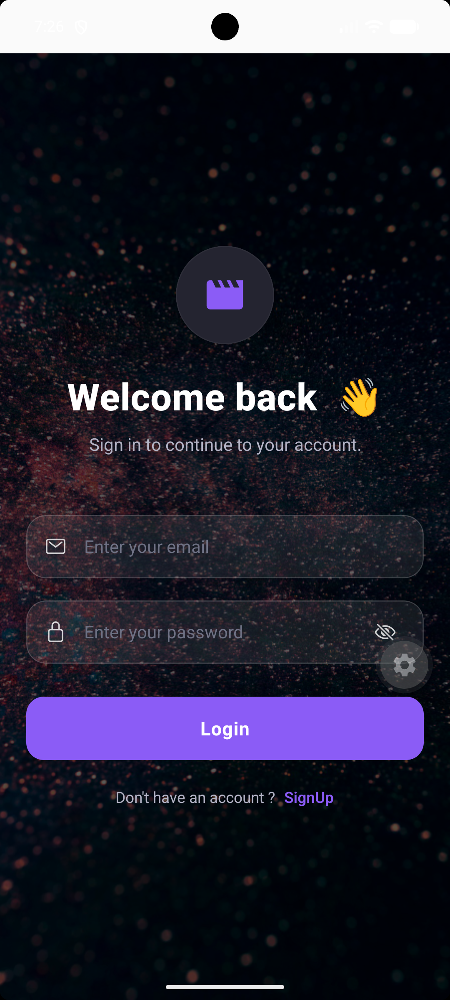
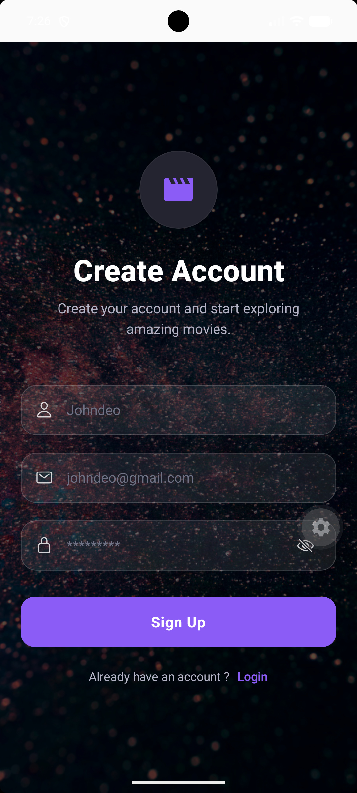
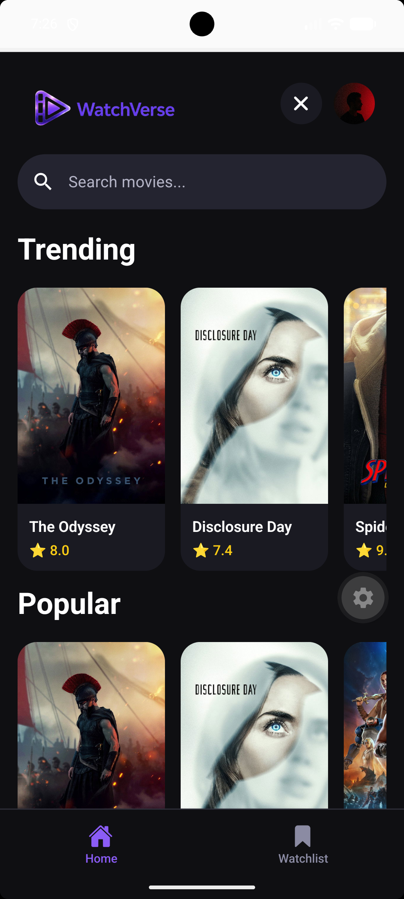
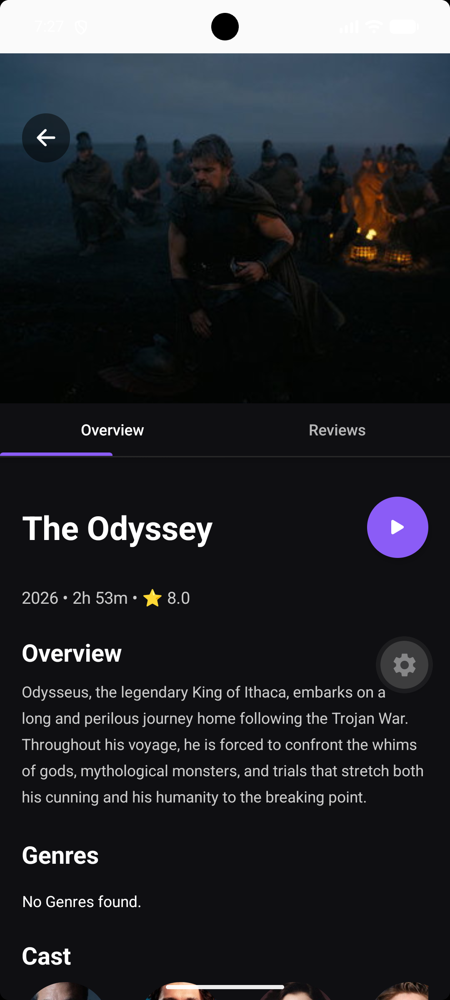
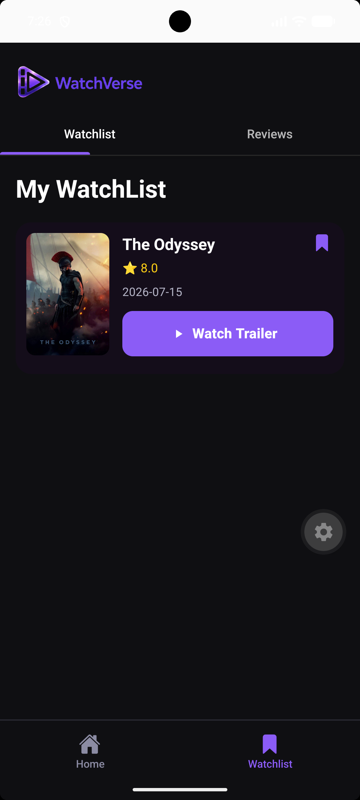
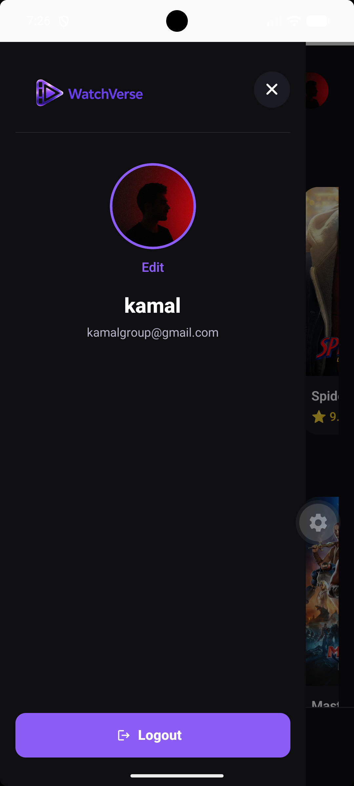

<div align="center">

# WatchVerse

Discover movies, manage your watchlist, and share reviews.


</div>

---
## 📱 Download APK

[Download WatchVerse APK](https://expo.dev/artifacts/eas/PxTJRUXBRdchdFoim5IOg0hRKh-sFZ5Hl6-TQDx224s.apk)

## Features

| Category | Included |
|----------|----------|
| **Authentication** | ✔ Email & Password Login<br>✔ Secure Authentication<br>✔ Persistent Sessions<br>✔ Logout |
| **Profile** | ✔ User Profile<br>✔ Avatar Upload<br>✔ Default Avatar<br>✔ Update Profile Picture |
| **Movie Discovery** | ✔ Trending Movies<br>✔ Popular Movies<br>✔ Top Rated Movies<br>✔ Live Search |
| **Movie Details** | ✔ Overview<br>✔ Genres<br>✔ Runtime<br>✔ Release Date<br>✔ Ratings |
| **Reviews** | ✔ Add Reviews<br>✔ Edit Reviews<br>✔ Delete Reviews<br>✔ Community Reviews<br>✔ Personal Reviews |
| **Watchlist** | ✔ Add Movies<br>✔ Remove Movies<br>✔ Personal Watchlist |
| **UI** | ✔ Dark Theme<br>✔ Drawer Navigation<br>✔ Responsive Layout<br>✔ Loading & Empty States |

---

## Tech Stack

| Technology | Purpose |
|------------|---------|
| React Native | Mobile Application |
| Expo SDK 57 | Development Framework |
| Expo Router | Navigation |
| Supabase | Authentication & Database |
| Supabase Storage | Avatar Storage |
| TMDB API | Movie Data |
| Zustand | State Management |
| React Native Paper | UI Components |
| Expo Image Picker | Image Selection |

---
## Screenshots

<div align="center">

| Login | Sign Up |
|--------|---------|
|  |  |

| Home | Movie Details |
|------|---------------|
|  |  |

| Watchlist | Profile |
|-----------|---------|
|  |  |

</div>
## Installation

```bash
git clone https://github.com/yourusername/WatchVerse.git

cd WatchVerse

npm install

npx expo start
```

---

## Environment Variables

Create a `.env` file.

```env
EXPO_PUBLIC_SUPABASE_URL=YOUR_SUPABASE_URL
EXPO_PUBLIC_SUPABASE_ANON_KEY=YOUR_SUPABASE_ANON_KEY
EXPO_PUBLIC_TMDB_API_KEY=YOUR_TMDB_API_KEY
```

---

<div align="center">

Built with React Native, Expo, Supabase, and TMDB API.

</div>